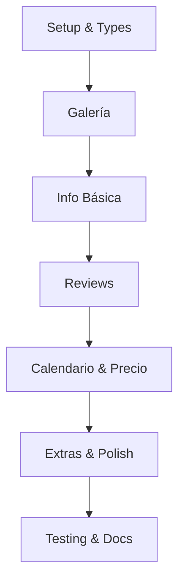

# 🚀 QUICK START - MILESTONE 3

> Guía rápida para implementar la Página de Detalle de Propiedad

---

## ⏱️ TIEMPO ESTIMADO: 8-10 horas

---

## 📋 CHECKLIST RÁPIDO

### DÍA 1 (4-5 horas) - FUNDACIÓN Y UI

#### Setup (30 min)
```bash
- [ ] Crear app/propiedad/[id]/page.tsx
- [ ] Crear components/property/ (carpeta)
- [ ] Actualizar types/search.ts con PropertyDetail, Review, etc.
- [ ] Extender mock-properties-db.ts con descripciones
- [ ] Crear mock-reviews-db.ts
```

#### Galería (1.5h)
```bash
- [ ] PropertyGallery.tsx (grid 1+4)
- [ ] ImageGalleryModal.tsx (fullscreen con Radix Dialog)
- [ ] Navegación con flechas y teclado
```

#### Información (1.5h)
```bash
- [ ] PropertyHeader.tsx (título, ubicación, rating)
- [ ] PropertyInfo.tsx (descripción, capacidad)
- [ ] HostSection.tsx (info del anfitrión)
- [ ] AmenitiesList.tsx (amenidades con iconos)
```

**✅ COMMIT**: "feat: página de detalle - galería e información básica"

---

### DÍA 2 (4-5 horas) - FEATURES Y TESTING

#### Reviews (1h)
```bash
- [ ] ReviewsSection.tsx (header con breakdown)
- [ ] ReviewCard.tsx (tarjeta individual)
- [ ] ReviewsList.tsx (paginación y filtros)
```

#### Calendario y Precio (1.5h)
```bash
- [ ] AvailabilityCalendar.tsx (react-day-picker)
- [ ] PriceCalculator.tsx (card sticky)
- [ ] lib/pricing/calculate-price.ts (lógica)
```

#### Extras (1h)
```bash
- [ ] PropertyMap.tsx (iframe o placeholder)
- [ ] PropertyRules.tsx (reglas de la casa)
- [ ] SimilarProperties.tsx (carrusel)
- [ ] ShareButton.tsx (copiar link)
```

#### Final (1h)
```bash
- [ ] Layout 2 columnas en page.tsx
- [ ] loading.tsx y error.tsx
- [ ] Responsive design
- [ ] Integrar con búsqueda y auth
- [ ] Testing manual completo
- [ ] npm run lint
```

**✅ COMMIT**: "feat: página de detalle completa con reviews, calendario y precio"

---

## 🎯 COMPONENTES CLAVE

### 1. PropertyGallery (45 min)
```tsx
// components/property/PropertyGallery.tsx
'use client';

import { useState } from 'react';
import Image from 'next/image';
import { ImageGalleryModal } from './ImageGalleryModal';

interface PropertyGalleryProps {
  images: string[];
  title: string;
}

export function PropertyGallery({ images, title }: PropertyGalleryProps) {
  const [showModal, setShowModal] = useState(false);
  const [currentIndex, setCurrentIndex] = useState(0);

  return (
    <>
      {/* Desktop: Grid 1+4 */}
      <div className="hidden md:grid md:grid-cols-4 gap-2 rounded-xl overflow-hidden">
        {/* Imagen principal */}
        <div className="col-span-2 row-span-2 relative h-[400px]">
          <Image src={images[0]} alt={title} fill className="object-cover" />
        </div>
        {/* Imágenes secundarias */}
        {images.slice(1, 5).map((img, i) => (
          <div key={i} className="relative h-[196px]">
            <Image src={img} alt={`${title} ${i+1}`} fill className="object-cover" />
          </div>
        ))}
      </div>

      {/* Mobile: Carrusel simple */}
      <div className="md:hidden">
        {/* Implementar carrusel básico */}
      </div>

      {/* Botón "Ver todas las fotos" */}
      <button 
        onClick={() => setShowModal(true)}
        className="absolute bottom-4 right-4 bg-white px-4 py-2 rounded-lg"
      >
        Ver todas ({images.length})
      </button>

      <ImageGalleryModal 
        open={showModal}
        onClose={() => setShowModal(false)}
        images={images}
        currentIndex={currentIndex}
      />
    </>
  );
}
```

### 2. PriceCalculator (45 min)
```tsx
// components/property/PriceCalculator.tsx
'use client';

import { useState } from 'react';
import { AvailabilityCalendar } from './AvailabilityCalendar';
import { GuestsSelector } from '../search/GuestsSelector';
import { calculatePriceBreakdown } from '@/lib/pricing/calculate-price';
import { formatPrice } from '@/lib/utils';

interface PriceCalculatorProps {
  property: Property;
}

export function PriceCalculator({ property }: PriceCalculatorProps) {
  const [checkIn, setCheckIn] = useState<Date>();
  const [checkOut, setCheckOut] = useState<Date>();
  const [guests, setGuests] = useState({ adults: 1, children: 0, infants: 0 });

  const breakdown = calculatePriceBreakdown({
    basePrice: property.pricing.basePrice,
    checkIn,
    checkOut,
    cleaningFee: property.pricing.cleaningFee,
  });

  return (
    <div className="sticky top-24 border rounded-xl p-6 shadow-lg">
      {/* Precio destacado */}
      <div className="flex items-baseline gap-2 mb-4">
        <span className="text-2xl font-bold">
          {formatPrice(property.pricing.basePrice)}
        </span>
        <span className="text-gray-600">/ noche</span>
      </div>

      {/* Calendario */}
      <AvailabilityCalendar 
        onDateSelect={(start, end) => {
          setCheckIn(start);
          setCheckOut(end);
        }}
      />

      {/* Huéspedes */}
      <GuestsSelector guests={guests} onChange={setGuests} />

      {/* Desglose de precios */}
      {breakdown && (
        <div className="mt-4 space-y-2 border-t pt-4">
          <div className="flex justify-between">
            <span>{formatPrice(breakdown.basePrice)} × {breakdown.nights} noches</span>
            <span>{formatPrice(breakdown.subtotal)}</span>
          </div>
          <div className="flex justify-between">
            <span>Tarifa de limpieza</span>
            <span>{formatPrice(breakdown.cleaningFee)}</span>
          </div>
          <div className="flex justify-between">
            <span>Tarifa de servicio</span>
            <span>{formatPrice(breakdown.serviceFee)}</span>
          </div>
          <div className="flex justify-between font-bold text-lg border-t pt-2">
            <span>Total</span>
            <span>{formatPrice(breakdown.total)}</span>
          </div>
        </div>
      )}

      {/* Botón Reservar */}
      <button className="w-full bg-[#FF385C] hover:bg-[#E31C5F] text-white font-semibold py-3 rounded-lg mt-4">
        Reservar
      </button>
    </div>
  );
}
```

### 3. Página Principal (45 min)
```tsx
// app/propiedad/[id]/page.tsx
import { getPropertyById, getPropertyReviews } from '@/lib/search/mock-search-service';
import { PropertyGallery } from '@/components/property/PropertyGallery';
import { PropertyHeader } from '@/components/property/PropertyHeader';
import { PropertyInfo } from '@/components/property/PropertyInfo';
import { PriceCalculator } from '@/components/property/PriceCalculator';
// ... más imports

export default async function PropertyPage({ params }: { params: { id: string } }) {
  const property = await getPropertyById(params.id);
  
  if (!property) {
    return <div>Propiedad no encontrada</div>;
  }

  const reviews = await getPropertyReviews(params.id);

  return (
    <main className="max-w-7xl mx-auto px-4 py-8">
      <PropertyHeader property={property} />
      
      <PropertyGallery images={property.images} title={property.title} />

      <div className="grid grid-cols-1 lg:grid-cols-12 gap-8 mt-8">
        {/* Columna principal */}
        <div className="lg:col-span-8 space-y-8">
          <PropertyInfo property={property} />
          <HostSection host={property.host} />
          <AmenitiesList amenities={property.amenities} />
          <ReviewsSection reviews={reviews} rating={property.rating} />
          <PropertyMap location={property.location} />
          <PropertyRules rules={property.rules} />
        </div>

        {/* Columna sticky */}
        <div className="lg:col-span-4">
          <PriceCalculator property={property} />
        </div>
      </div>

      <SimilarProperties currentProperty={property} />
    </main>
  );
}
```

---

## 🔧 FUNCIONES UTILITY

### Cálculo de Precios
```typescript
// lib/pricing/calculate-price.ts
import { differenceInDays } from 'date-fns';

interface PriceInput {
  basePrice: number;
  checkIn?: Date;
  checkOut?: Date;
  cleaningFee: number;
}

export function calculatePriceBreakdown(input: PriceInput) {
  if (!input.checkIn || !input.checkOut) return null;

  const nights = differenceInDays(input.checkOut, input.checkIn);
  if (nights <= 0) return null;

  const subtotal = input.basePrice * nights;
  const cleaningFee = input.cleaningFee;
  const serviceFee = subtotal * 0.1; // 10%
  const taxes = subtotal * 0.05; // 5%
  const total = subtotal + cleaningFee + serviceFee + taxes;

  return {
    basePrice: input.basePrice,
    nights,
    subtotal,
    cleaningFee,
    serviceFee,
    taxes,
    total,
  };
}
```

---

## 📦 DATOS MOCK

### Extender Propiedades
```typescript
// lib/search/mock-properties-db.ts (agregar a cada propiedad)

description: {
  space: "Apartamento acogedor de 2 habitaciones...",
  guestAccess: "Acceso completo al apartamento...",
  otherThings: "Cerca de transporte público..."
},
rules: [
  "No fumar",
  "No se admiten mascotas",
  "No se permiten fiestas",
  "Check-in: 15:00 - 22:00",
  "Check-out: 11:00"
],
cancellationPolicy: "Cancelación gratuita hasta 5 días antes",
responseTime: "1 hora",
responseRate: 100
```

### Reviews Mock
```typescript
// lib/search/mock-reviews-db.ts
export const MOCK_REVIEWS: Review[] = [
  {
    id: '1',
    propertyId: 'prop-1',
    userId: 'user-1',
    userName: 'María García',
    userAvatar: '/avatars/user-1.jpg',
    rating: 5,
    comment: 'Excelente ubicación, apartamento muy limpio...',
    date: new Date('2024-11-01'),
    helpful: 12
  },
  // ... más reviews
];

export function getReviewsByProperty(propertyId: string) {
  return MOCK_REVIEWS.filter(r => r.propertyId === propertyId);
}
```

---

## ✅ TESTING CHECKLIST

### Funcional
- [ ] Click en PropertyCard → Abre detalle
- [ ] Galería: Click "Ver todas" → Modal fullscreen
- [ ] Galería: Flechas navegan entre fotos
- [ ] Galería: ESC cierra modal
- [ ] Calendario: Seleccionar fechas funciona
- [ ] Precio: Se calcula correctamente
- [ ] Favorito: Requiere login
- [ ] Compartir: Copia link correctamente
- [ ] Reviews: Paginación funciona
- [ ] Propiedades similares: Navega correctamente

### Responsive
- [ ] Mobile: Galería es carrusel
- [ ] Mobile: Precio es sticky bottom
- [ ] Tablet: Layout stack vertical
- [ ] Desktop: Layout 2 columnas (8/4)

### Estados
- [ ] Loading: Skeleton se muestra
- [ ] Error: Mensaje amigable si no existe
- [ ] Empty: Maneja propiedades sin reviews

---

## 🚨 ERRORES COMUNES A EVITAR

1. ❌ **No usar Image de Next.js**
   - ✅ Usar `<Image />` con `fill` para responsive

2. ❌ **No manejar estados de loading**
   - ✅ Crear loading.tsx con Skeleton

3. ❌ **Componentes muy grandes (>100 líneas)**
   - ✅ Dividir en subcomponentes

4. ❌ **No usar constantes**
   - ✅ Usar lib/constants.ts para textos y config

5. ❌ **Olvidar responsive design**
   - ✅ Testing en mobile, tablet, desktop

6. ❌ **No integrar con auth**
   - ✅ Favoritos requieren autenticación

---

## 🎯 ORDEN RECOMENDADO



---

## 📝 COMMITS RECOMENDADOS

```bash
# Día 1
git add .
git commit -m "feat: estructura y tipos para detalle de propiedad"
git commit -m "feat: galería de imágenes con modal fullscreen"
git commit -m "feat: información básica de propiedad y host"

# Día 2
git commit -m "feat: sistema de reviews con paginación"
git commit -m "feat: calendario de disponibilidad y calculadora de precio"
git commit -m "feat: componentes complementarios (mapa, reglas, similares)"
git commit -m "feat: página de detalle completa y responsive"
git push origin main
```

---

## 💡 TIPS FINALES

1. **Reutiliza componentes**: GuestsSelector ya existe, úsalo
2. **Usa formatPrice()**: Ya tienes helper en lib/utils.ts
3. **Testing continuo**: No esperes al final para probar
4. **Mobile first**: Diseña primero para móvil
5. **Estados robustos**: Loading, error, empty siempre

---

## 🎉 AL TERMINAR

- [ ] ✅ 0 errores de linting
- [ ] ✅ 0 errores de TypeScript
- [ ] ✅ Testing manual completo
- [ ] ✅ Responsive funcional
- [ ] ✅ Commit & Push
- [ ] ✅ Actualizar MILESTONE_3.md con "COMPLETADO"

---

**¡Éxito con la implementación!** 🚀

Si tienes dudas, revisa `MILESTONE_3.md` para más detalles.

